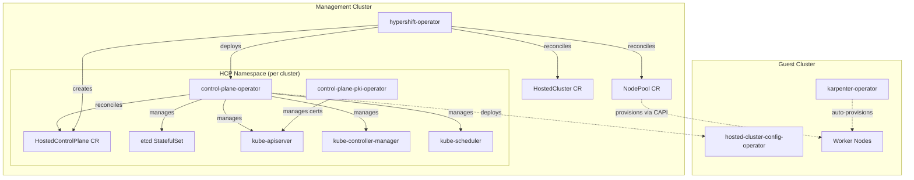
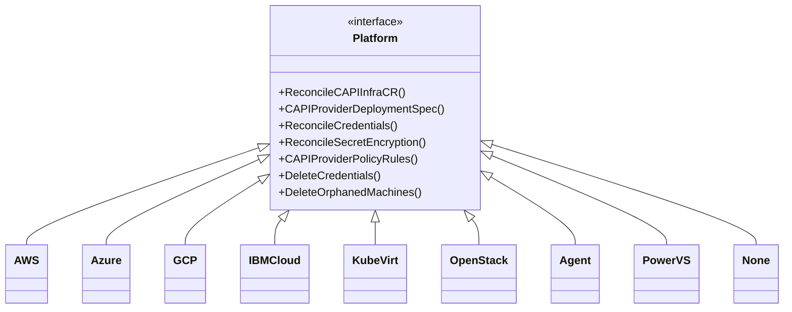

# Architecture

## System Architecture Overview

HyperShift implements a hosted control plane model where OpenShift control planes run as workloads on a management cluster. The architecture separates management (operator) concerns from workload (hosted cluster) concerns.

## Operator Architecture

### hypershift-operator (Management Cluster Singleton)

Runs once on the management cluster with leader election (60s lease). Reconciles top-level CRDs and orchestrates hosted cluster lifecycle.

**Primary Controllers:**

| Controller | CRD | Concurrency | Purpose |
|-----------|-----|-------------|---------|
| HostedClusterReconciler | HostedCluster | 10 | Core lifecycle: creates HCP namespace, HostedControlPlane, CAPI resources, deploys CPO |
| NodePoolReconciler | NodePool | 10 | Manages CAPI MachineDeployments, ignition configs, machine templates per platform |
| AWSEndpointServiceReconciler | AWSEndpointService | - | AWS VPC PrivateLink (conditional) |
| AzurePrivateLinkServiceController | AzurePrivateLinkService | - | Azure Private Link (conditional) |
| GCPPrivateServiceConnectReconciler | GCPPrivateServiceConnect | - | GCP PSC (conditional) |
| HCPEtcdBackupReconciler | HCPEtcdBackup | - | etcd backups (feature-gated) |
| SharedIngressReconciler | - | - | Multi-tenant ingress (conditional) |
| WebhookCertReconciler | Secret | - | Webhook server TLS certs (conditional on `--cert-dir`) |
| hostedclustersizing.reconciler | HostedCluster | - | Applies t-shirt sizing labels (conditional on `ENABLE_SIZE_TAGGING=1`) |
| hostedclustersizing.validator | HostedCluster | - | Validates sizing configuration |
| supportedversion.Reconciler | ConfigMap | - | Maintains supported OCP versions ConfigMap |
| uwmtelemetry.Reconciler | - | - | User Workload Monitoring telemetry remote write (conditional) |
| proxy.reconciler | Proxy config | - | Watches proxy configuration on OpenShift mgmt clusters (conditional) |
| auditlogpersistence.SnapshotReconciler | PVC snapshots | - | Audit log persistence snapshots (conditional on `ENABLE_AUDIT_LOG_PERSISTENCE`) |
| resourcebasedcpautoscaler.Controller | HostedCluster + VPA | - | Resource-based control plane autoscaling via VPA (conditional) |

**Scheduling Controllers** (conditional on `--enable-dedicated-request-serving-isolation`):
- DedicatedServingComponentSchedulerAndSizer, PlaceholderScheduler, RequestServingNodeAutoscaler, MachineSetDescaler, NonRequestServingNodeAutoscaler (size-tagging mode)
- DedicatedServingComponentScheduler, DedicatedServingComponentNodeReaper (legacy mode)

### control-plane-operator (Per-Cluster)

One CPO instance per hosted cluster, running in the HCP namespace. Multi-binary image with two dispatch mechanisms:

**argv[0] dispatch** (13 entries in `commandFor()` switch): kas-bootstrap, ignition-server, konnectivity-socks5-proxy, konnectivity-https-proxy, availability-prober, token-minter, etcd-defrag-controller, etcd-upload, sync-fg-configmap, sync-global-pullsecret, fetch-etcd-certs, endpoint-resolver, metrics-proxy.

**Subcommands** (via `AddCommand`, overlapping set): All of the above plus start (CPO itself), hosted-cluster-config-operator, kubernetes-default-proxy, dns-resolver, etcd-backup.

**CPO controllers** (`control-plane-operator/controllers/`): HostedControlPlaneReconciler, HealthCheckUpdater, openshiftmanager.Reconciler, plus platform-specific private service controllers (AWS, Azure, GCP).

**v2 Component Framework**: The CPO reconciles ~40 control plane components through a declarative framework (`support/controlplane-component/`):

| Category | Components |
|----------|-----------|
| Core K8s | etcd, kube-apiserver, kube-controller-manager, kube-scheduler |
| OpenShift | openshift-apiserver, openshift-controller-manager, oauth-server, oauth-apiserver, route-controller-manager, cluster-policy-controller, cluster-version-operator |
| Networking | cluster-network-operator, ingress-operator, dns-operator, konnectivity-agent |
| Cloud Controllers | aws-ccm, azure-ccm, gcp-ccm, kubevirt-ccm, openstack-ccm, powervs-ccm |
| Storage | storage-operator, kubevirt-csi, snapshot-controller |
| Infrastructure | cloud-credential-operator, machine-approver, ignition-server, ignition-server-proxy, endpoint-resolver, metrics-proxy |
| Monitoring | node-tuning-operator, image-registry-operator |
| Autoscaling | autoscaler, aws-node-termination-handler, karpenter, karpenter-operator |
| CAPI | capi-manager, capi-provider |
| OLM | catalog-operator, olm-operator, packageserver, collect-profiles |
| PKI | pki-operator |
| Config | feature-gate configmap, hosted-cluster-config-operator, control-plane-operator (self-management) |
| Routing | router (ingress router) |

### control-plane-pki-operator

Uses library-go controller framework (not controller-runtime). Manages certificate rotation and break-glass certificate signing.

**Controllers**: TargetConfigController, CertRotationController, CustomerCertSigningRequestApprovalController, SRECertSigningRequestApprovalController, CertificateRevocationController, and cert loading/signing controllers for both customer and SRE break-glass paths.

### karpenter-operator

Dual-cluster operator: management cluster for HCP resources, guest cluster for Karpenter CRDs.

**Controllers**: karpenter.Reconciler (manages Karpenter deployment), MachineApproverController (CSR approval), EC2NodeClassReconciler (syncs EC2NodeClass), KarpenterIgnitionReconciler (ignition configs for Karpenter nodes).

## Design Patterns

### Controller-Runtime Patterns
- All operators (except PKI) use `sigs.k8s.io/controller-runtime` with `ctrl.NewManager`
- Controllers implement `SetupWithManager(mgr ctrl.Manager)` and `Reconcile(ctx, req)`
- Rate limiting: `workqueue.NewTypedItemExponentialFailureRateLimiter` (1s-10s)
- Owner references for garbage collection
- Finalizers for cleanup (`hypershift.openshift.io/finalizer`)

### v2 Component Framework
- Fluent builder API: `NewDeploymentComponent("name", opts).WithAdaptFunction(adapt).Build()`
- Dependency tracking: components declare dependencies; reconciliation blocks until deps are `Available` and `RolloutComplete`
- Embedded YAML manifests in `v2/assets/{component}/`
- Automatic sidecar injection (Konnectivity, token-minter)
- Read-only client for components (cannot create arbitrary resources)

### Platform Abstraction

Implementations in `hypershift-operator/controllers/hostedcluster/internal/platform/`. Dispatched via `GetPlatform()` based on `hcluster.Spec.Platform.Type`.

### Resource Management
- `support/upsert/`: CreateOrUpdateProvider with reconciliation loop detection
- Label-enforcing client wrapper for mandatory labels
- `support/config/`: Standardized resource requirements, scheduling, security contexts

### Private Connectivity
Three parallel implementations for private cluster networking:
- **AWS**: VPC PrivateLink / Endpoint Services
- **Azure**: Private Link Services / Private Endpoints / Private DNS Zones
- **GCP**: Private Service Connect
