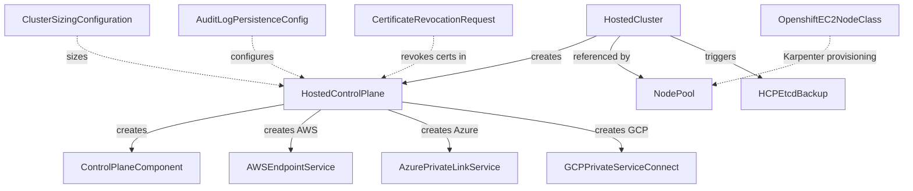
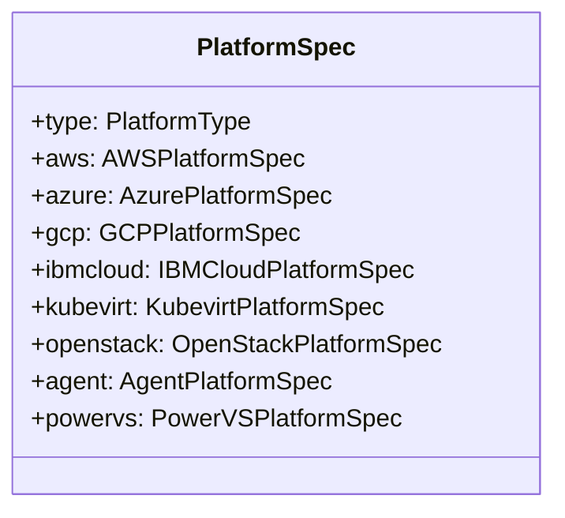

# Data Models

## CRD Type Hierarchy

## hypershift.openshift.io/v1beta1

### HostedCluster

The top-level user-facing resource. Shortnames: `hc`, `hcs`.

**Spec (key fields):**

| Field | Type | Description |
|-------|------|-------------|
| `release` | Release | OCP release image for the hosted cluster |
| `controlPlaneRelease` | Release | Optional separate release for control plane |
| `clusterID` | string | Unique cluster identifier |
| `infraID` | string | Infrastructure identifier |
| `platform` | PlatformSpec | Cloud platform configuration (discriminated union) |
| `networking` | ClusterNetworking | Cluster/service/machine networks, network type |
| `services` | []ServicePublishingStrategyMapping | Publishing strategies for APIServer, OAuth, Konnectivity, Ignition |
| `pullSecret` | LocalObjectReference | Image pull secret |
| `sshKey` | LocalObjectReference | SSH key for nodes |
| `etcd` | EtcdSpec | etcd configuration (managed vs unmanaged) |
| `secretEncryption` | SecretEncryptionSpec | KMS configuration |
| `configuration` | ClusterConfiguration | Embeds OpenShift config APIs |
| `autoscaling` | ClusterAutoscaling | Cluster autoscaler settings |
| `autoNode` | AutoNode | Karpenter auto-node config |
| `fips` | bool | FIPS mode |
| `pausedUntil` | string | Pause reconciliation until timestamp |

**Status (key fields):**

| Field | Type | Description |
|-------|------|-------------|
| `conditions` | []Condition | Cluster health conditions |
| `version` | ClusterVersionStatus | Desired, history, available updates |
| `controlPlaneEndpoint` | APIEndpoint | KAS endpoint (host + port) |
| `kubeconfig` | LocalObjectReference | Admin kubeconfig reference |
| `kubeadminPassword` | LocalObjectReference | Admin password reference |
| `payloadArch` | string | Release payload architecture |
| `platform` | PlatformStatus | Platform-specific status |

### PlatformSpec (Discriminated Union)

Platform types: AWS, Azure, GCP, IBMCloud, KubeVirt, OpenStack, Agent, PowerVS, None.

Platform-specific types defined in separate files:
- `api/hypershift/v1beta1/aws.go` — AWSPlatformSpec, AWSNodePoolPlatform, AWSResourceTag, etc.
- `api/hypershift/v1beta1/azure.go` — AzurePlatformSpec, AzureNodePoolPlatform, etc.
- `api/hypershift/v1beta1/gcp.go` — GCPPlatformSpec, GCPNodePoolPlatform, etc.
- `api/hypershift/v1beta1/kubevirt.go` — KubevirtPlatformSpec, KubevirtNodePoolPlatform, etc.
- `api/hypershift/v1beta1/openstack.go` — OpenStackPlatformSpec, OpenStackNodePoolPlatform, etc.
- `api/hypershift/v1beta1/powervs.go` — PowerVSPlatformSpec, PowerVSNodePoolPlatform, etc.
- `api/hypershift/v1beta1/agent.go` — AgentPlatformSpec, AgentNodePoolPlatform, etc.

### NodePool

Worker node pool. Shortnames: `np`, `nps`. Has scale subresource.

**Spec (key fields):**

| Field | Type | Description |
|-------|------|-------------|
| `clusterName` | string | Immutable reference to HostedCluster |
| `release` | Release | OCP release for nodes |
| `platform` | NodePoolPlatform | Platform-specific node configuration |
| `replicas` | *int32 | Fixed replica count (mutually exclusive with autoScaling) |
| `autoScaling` | *NodePoolAutoScaling | Min/max autoscaling bounds |
| `management` | NodePoolManagement | Upgrade type (Replace/InPlace), autoRepair |
| `config` | []LocalObjectReference | MachineConfig references |
| `arch` | string | Architecture (amd64/arm64/ppc64le/s390x) |
| `taints` | []Taint | Node taints |
| `nodeLabels` | map[string]string | Node labels |

### HostedControlPlane

Internal control plane representation. Shortnames: `hcp`, `hcps`. Primary input for the CPO.

**Spec (key fields)**: releaseImage, controlPlaneReleaseImage, pullSecret, issuerURL, infraID, platform, dns, etcd, services, networking, configuration, operatorConfiguration, autoscaling, autoNode, fips, pausedUntil, capabilities. Closely mirrors HostedClusterSpec.

**Status (key fields)**: conditions, ready, initialized, externalManagedControlPlane, controlPlaneEndpoint, controlPlaneVersion, versionStatus, kubeConfig, customKubeconfig, kubeadminPassword, platform, nodeCount, autoNode, configuration.

### ControlPlaneComponent

Per-component status tracking (v2 framework). Shortnames: `cpc`, `cpcs`.
- **Spec**: Empty (marker resource)
- **Status**: conditions (Available, RolloutComplete), version, resources list

### AWSEndpointService

AWS VPC PrivateLink. Spec: networkLoadBalancerName, subnetIDs, resourceTags. Status: endpointServiceName, endpointID, dnsNames.

### AzurePrivateLinkService

Azure Private Link. Shortname: `azpls`.

**Spec fields**: loadBalancerIP, subscriptionID, resourceGroupName, location, natSubnetID, additionalAllowedSubscriptions, guestSubnetID, guestVNetID, baseDomain.

**Status fields**: conditions, internalLoadBalancerID, privateLinkServiceID, privateLinkServiceAlias, privateEndpointID, privateEndpointIP, privateDNSZoneID, dnsZoneName, baseDomainDNSZoneID.

### GCPPrivateServiceConnect

GCP PSC. Shortname: `gcppsc`. Feature-gated: `GCPPlatform`. Spec: loadBalancerIP, forwardingRuleName, consumerAcceptList, natSubnet. Status: serviceAttachmentName, endpointIP.

### HCPEtcdBackup

One-shot etcd backup. Shortname: `hcpetcdbk`. Feature-gated: `HCPEtcdBackup`. Spec: storage (union: S3 or AzureBlob, fully immutable). Status: snapshotURL, encryptionMetadata.

## certificates.hypershift.openshift.io/v1alpha1

### CertificateRevocationRequest
Shortnames: `crr`, `crrs`. Spec: signerClass (customer-break-glass or sre-break-glass, immutable). Status: revocationTimestamp, previousSigner, conditions.

## scheduling.hypershift.openshift.io/v1alpha1

### ClusterSizingConfiguration
Cluster-scoped singleton (name: "cluster"). Shortnames: `csc`, `cscs`.
- **Spec**: sizes (list with name, criteria.from/to, effects for priority/resources/KAS memory), concurrency (slidingWindow, limit), transitionDelay
- Controls t-shirt sizing of hosted control planes based on node count

## karpenter.hypershift.openshift.io/v1

### OpenshiftEC2NodeClass
Cluster-scoped. Shortnames: `oec2nc`, `oec2ncs`.
- **Spec**: subnetSelectorTerms, securityGroupSelectorTerms, capacityReservationSelectorTerms, blockDeviceMappings, metadataOptions, version (OCP version for Cincinnati resolution), kubelet
- **Status**: subnets, securityGroups, releaseImage, version

## auditlogpersistence.hypershift.openshift.io/v1alpha1

### AuditLogPersistenceConfig
Cluster-scoped singleton (name: "cluster"). Shortnames: `alpc`, `alpcs`.
- **Spec**: enabled, storage (storageClassName, size), auditLog (maxSize, maxBackup), snapshots (enabled, minInterval, retentionCount, volumeSnapshotClassName)

## Code Generation Markers

| Marker | Purpose |
|--------|---------|
| `+kubebuilder:object:root=true` | Root object (has ObjectMeta) |
| `+kubebuilder:object:generate=true` | Generate DeepCopy |
| `+kubebuilder:subresource:status` | Enable status subresource |
| `+kubebuilder:subresource:scale` | Enable scale subresource (NodePool) |
| `+kubebuilder:resource:shortName=...` | CRD short names |
| `+kubebuilder:resource:scope=Cluster` | Cluster-scoped CRD |
| `+genclient` | Generate typed client |
| `+genclient:nonNamespaced` | Cluster-scoped client |
| `+openshift:enable:FeatureGate=X` | Feature-gate entire type |
| `+openshift:validation:FeatureGateAwareEnum` | Feature-gate enum values |
| `+kubebuilder:validation:XValidation` | CEL validation rules |
