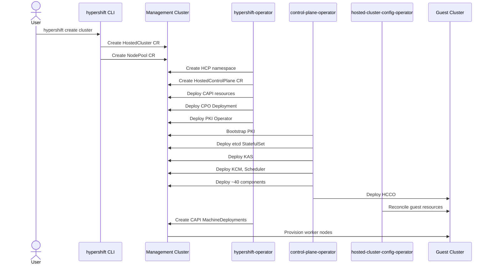
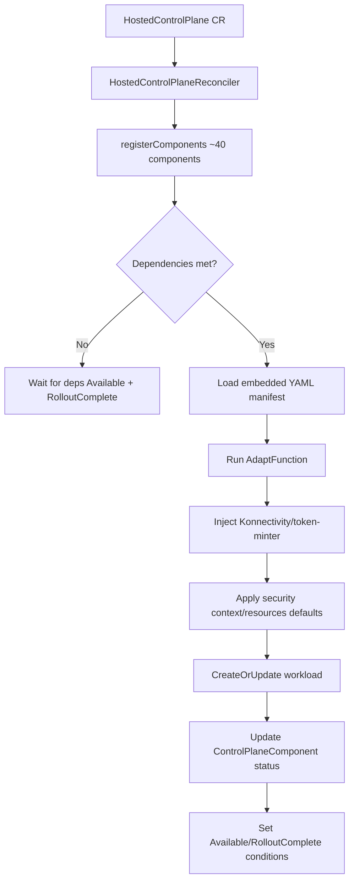
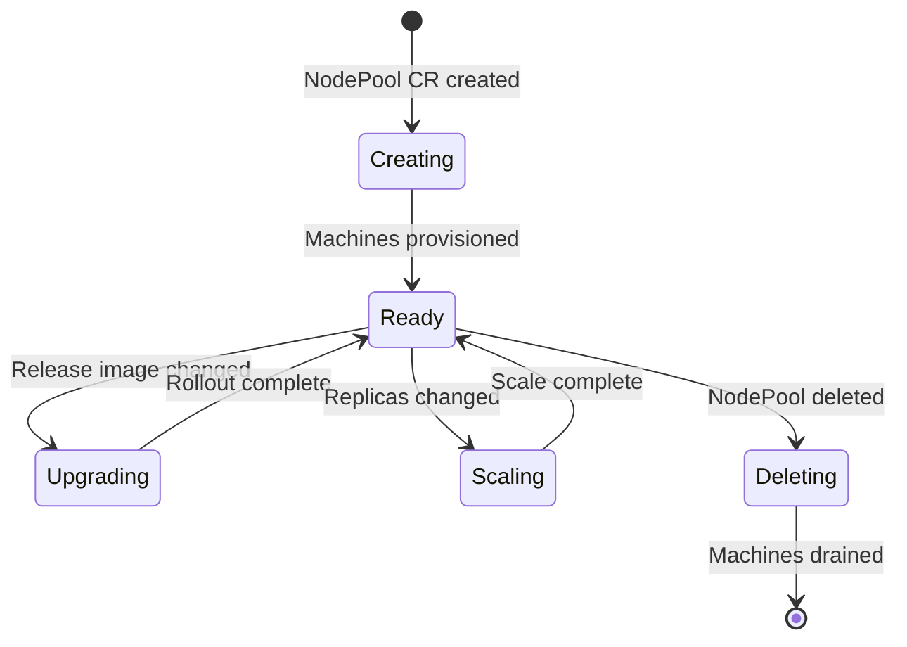
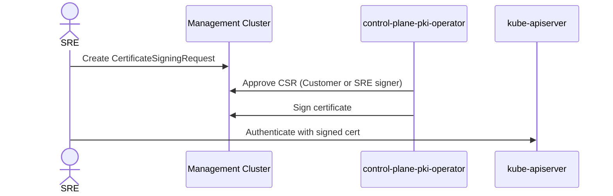
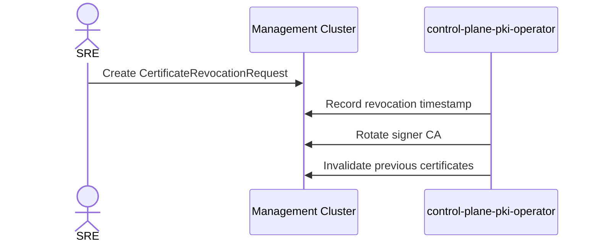
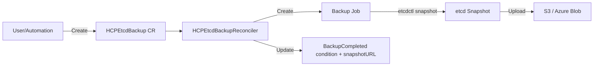
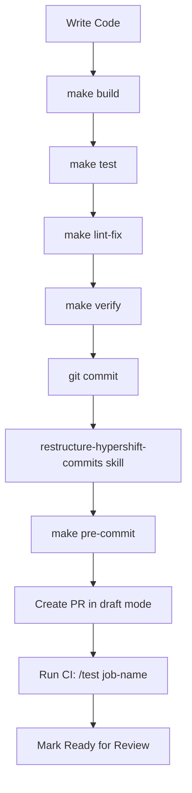
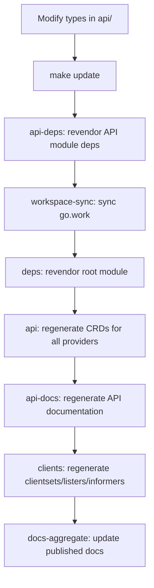
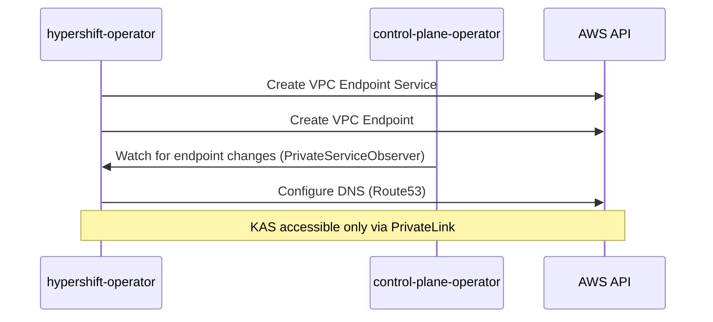
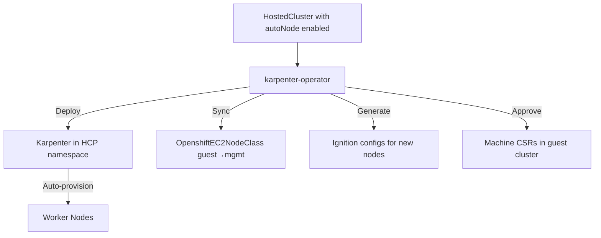

# Workflows

## Hosted Cluster Lifecycle

### Cluster Creation

### Cluster Deletion

1. User deletes HostedCluster CR (or runs `hypershift destroy cluster`)
2. hypershift-operator finalizer triggers cleanup:
   - Deletes NodePools and waits for machines to drain
   - Deletes HostedControlPlane
   - Cleans up CAPI resources
   - Removes platform-specific infrastructure (endpoint services, etc.)
   - Deletes HCP namespace
3. Platform.DeleteCredentials() cleans cloud credentials

## Control Plane Component Reconciliation (v2 Framework)

## NodePool Lifecycle

**NodePoolReconciler workflow:**
1. Reads NodePool spec
2. Generates ignition config (via ignition-server)
3. Creates/updates platform-specific MachineTemplate (AWSMachineTemplate, AzureMachineTemplate, etc.)
4. Reconciles CAPI MachineDeployment/MachineSet
5. For upgrades: performs rolling update with configurable strategy (Replace or InPlace)
6. Reports status (replicas, version, conditions)

## Certificate Management

### Break-Glass Certificate Flow

### Certificate Revocation

## etcd Operations

### Backup Flow

### Recovery Flow (etcd-recovery)

1. Scale down etcd StatefulSet to 0
2. Clear etcd data directories
3. Download snapshot from storage
4. Restore etcd from snapshot
5. Scale etcd StatefulSet back up

## Development Workflow

### Build and Test

### API Change Workflow

## CI Pipeline

### Pull Request Checks

| Workflow | Trigger | Purpose |
|----------|---------|---------|
| test | PR (code changes) | Sharded unit tests with race detection |
| verify | PR | Full verification (generate, fmt, vet, lint) |
| lint | PR | golangci-lint + kube-api-linter |
| envtest-ocp | PR (API changes) | CRD validation against OCP K8s versions |
| envtest-kube | PR (API changes) | CRD validation against vanilla K8s versions |
| codespell | PR | Spell checking |
| gitlint | PR | Commit message format |
| docs-build | PR (docs changes) | MkDocs build verification |
| cpo-container-sync | PR | CPO Containerfile sync check |

### Konflux/Tekton

Builds container images for:
- hypershift-operator (main branch + tags)
- control-plane-operator (main branch)
- hypershift-cli (mce-50 branch)
- hypershift-release (mce-50 branch)
- shared-ingress (main branch)
- GitHub Actions runner
- gomaxprocs-webhook

## Private Cluster Networking

### AWS PrivateLink Flow

### Azure Private Link Flow

Similar pattern with Azure Private Link Services, Private Endpoints, and Private DNS Zones.

### GCP PSC Flow

Similar pattern with GCP Private Service Connect and service attachments.

## Karpenter Auto-Scaling

